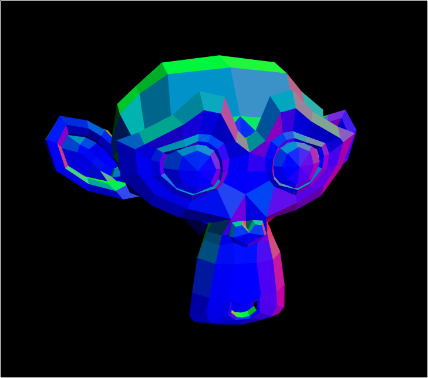

# rs-glfw3-gles2-test

This is a test of all the no-std crates:
* [rs-alloc](https://github.com/NeoCogi/rs-alloc)
* [rs-streams](https://github.com/NeoCogi/rs-streams)
* [rs-math3d](https://github.com/NeoCogi/rs-math3d)
* [rs-gles2](https://github.com/NeoCogi/rs-gles2)
* [rs-glfw3](https://github.com/NeoCogi/rs-glfw3)
* and others...

Enjoy!
